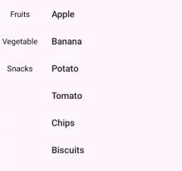
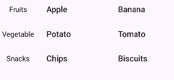

## LinkageRecyclerView
[](https://kotlinlang.org/)
[](LICENSE)
[](#)
---

A lightweight, flexible Android library for building linked (master–detail) RecyclerView layouts, where a category list is synchronized with a content list.

Ideal for:
- E-commerce category pages (Amazon / Flipkart style)
- Food menus
- Settings pages
- Any UI where scrolling content updates a side menu

### Features

- Two-way linkage
  - Scroll content → category updates
  - Click category → content scrolls to section
- Sticky headers (category headers stay visible while scrolling)
- Grid & Linear layout support
- Smooth / instant scroll configuration
- XML attribute support (easy UI configuration)
- Clean public API (no adapters exposed)
- Production-ready architecture

### Preview

<p align="center">
<table>
  <tr>
    <td align="center">
      
    </td>
    <td align="center">
      
    </td>
  </tr>
</table>
</p>

---

## Installation (JitPack)

### 1️⃣ Add JitPack to your **root `settings.gradle` or `build.gradle`**

```gradle
dependencyResolutionManagement {
    repositories {
        google()
        mavenCentral()
        maven { url 'https://jitpack.io' }
    }
}
```
### Add Dependency
```
dependencies {
	        implementation 'com.github.Excelsior-Technologies-Community:Android_LinkageRecyclerView:1.0.0'
	}
```

---

### Basic Usage

Use LinkageLayout in XML
```xml
<com.ext.linkagerecyclerview.LinkageLayout
    android:id="@+id/linkageLayout"
    android:layout_width="match_parent"
    android:layout_height="match_parent"
    app:lr_smoothScroll="true"
    app:lr_gridSpanCount="2"
    app:lr_categoryWidth="90dp"
    app:lr_headerHeight="56dp" />
```

Provide data in Activity / Fragment
```kotlin
val linkageLayout = findViewById<LinkageLayout>(R.id.linkageLayout)

linkageLayout.setup(
    LinkageData(
        categories = listOf(
            "Fruits",
            "Vegetables",
            "Snacks"
        ),
        items = mapOf(
            "Fruits" to listOf("Apple", "Banana"),
            "Vegetables" to listOf("Potato", "Tomato"),
            "Snacks" to listOf("Chips", "Biscuits")
        )
    )
)

linkageLayout.attach()
```

---

### Linkage Behavior

Category → Content

Clicking a category automatically scrolls content to the first item of that category.

Content → Category

Scrolling content automatically highlights the current category.

This is the default and only supported mode (linked scroll mode).

---

### 🎛 Customization Options (XML Attributes)

| Attribute | Description | Default |
|---------|-------------|---------|
| `lr_smoothScroll` | Enables smooth scrolling when a category is clicked | `true` |
| `lr_gridSpanCount` | Number of columns in content grid (`1` = Linear layout) | `1` |
| `lr_enableStickyHeader` | Enables sticky category headers while scrolling | `false` |
| `lr_categoryWidth` | Width of the category (left) panel | `100dp` |
| `lr_headerHeight` | Height of the sticky header | `100dp` |

---

### License

```
MIT License

Copyright (c) 2025 Excelsior Technologies 

Permission is hereby granted, free of charge, to any person obtaining a copy
of this software and associated documentation files (the "Software"), to deal
in the Software without restriction, including without limitation the rights
to use, copy, modify, merge, publish, distribute, sublicense, and/or sell
copies of the Software, and to permit persons to whom the Software is
furnished to do so, subject to the following conditions:

The above copyright notice and this permission notice shall be included in all
copies or substantial portions of the Software.

THE SOFTWARE IS PROVIDED "AS IS", WITHOUT WARRANTY OF ANY KIND, EXPRESS OR
IMPLIED, INCLUDING BUT NOT LIMITED TO THE WARRANTIES OF MERCHANTABILITY,
FITNESS FOR A PARTICULAR PURPOSE AND NONINFRINGEMENT. IN NO EVENT SHALL THE
AUTHORS OR COPYRIGHT HOLDERS BE LIABLE FOR ANY CLAIM, DAMAGES OR OTHER
LIABILITY, WHETHER IN AN ACTION OF CONTRACT, TORT OR OTHERWISE, ARISING FROM,
OUT OF OR IN CONNECTION WITH THE SOFTWARE OR THE USE OR OTHER DEALINGS IN THE
SOFTWARE.
```

